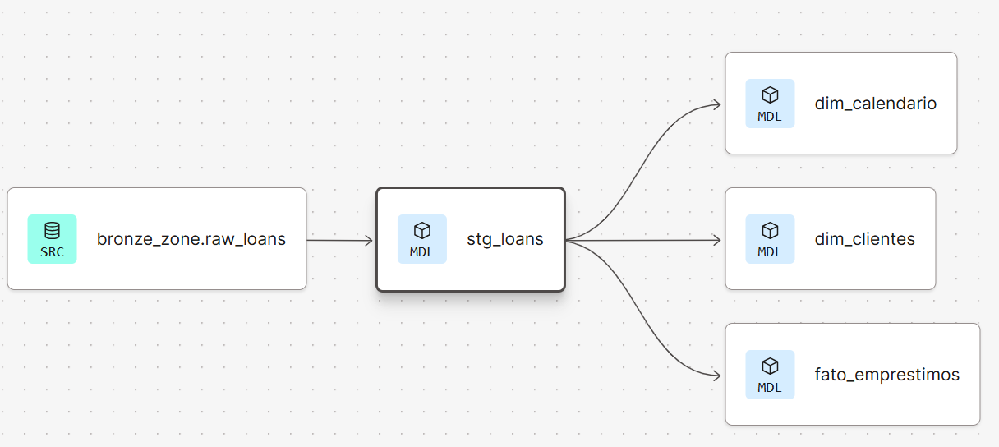

# 📊 Análise de Risco de Crédito (Credit Risk Analytics)


---

## 🎯 1. O Problema de Negócio

A equipa de Risco e a Diretoria Executiva carecem de uma fonte única da verdade (*Single Source of Truth*) automatizada e confiável. Atualmente, a empresa não consegue responder de forma rápida e precisa a cinco perguntas cruciais:

1. Qual é o volume financeiro e a quantidade de crédito concedido mensalmente?
2. Qual é o perfil demográfico e financeiro dos clientes que estão a tomar crédito?
3. Qual é a taxa real de inadimplência (*Default Rate*) por safra (mês de emissão)?
4. Qual é a exposição atual ao risco da carteira (valores em atraso)?
5. Qual é a rentabilidade líquida estimada (Juros recebidos vs. Principal perdido)?

## 🚀 2. Objetivos do Projeto

Desenvolver uma arquitetura de dados moderna (*Modern Data Stack*) de ponta a ponta que elimine o trabalho manual e forneça dados modelados e testados para a área de negócios. Os objetivos técnicos e de negócio incluem:

* **Engenharia de Dados:** Criar um pipeline de ingestão automatizado via Python para carregar os dados transacionais brutos na nuvem, utilizando processamento em blocos (*chunks*).
* **Engenharia de Analytics:** Construir um Data Warehouse utilizando a arquitetura medalhão (Bronze, Silver/Staging, Gold/Marts) com dbt.
* **Qualidade e Governança:** Garantir a integridade dos dados através de testes automatizados (chaves primárias únicas, valores não nulos e aceitáveis) e tratamento de IDs ausentes via *Surrogate Keys*.
* **Business Intelligence:** Disponibilizar um painel interativo (Dashboard) que traduza as tabelas modeladas em *insights* visuais e acionáveis para a diretoria.

---

## 🏗️ 3. Arquitetura de Dados (Modern Data Stack)

A arquitetura foi desenhada para ser escalável e tolerante a falhas, garantindo que os dados fluam da origem (ficheiros CSV) até ao Dashboard de forma estruturada.

<div align="center">
  <picture>
    <source media="(prefers-color-scheme: dark)" srcset="img/arquitetura_fintech_Medallion_Arquiteture_white.drawio.svg">
    <source media="(prefers-color-scheme: light)" srcset="img/arquitetura_fintech_Medallion_Arquiteture_dark.drawio.svg">
    
  </picture>
</div>

---

## 🔄 4. Fluxo de Dados (Data Flow)

O processo de ELT(Modern Analytics) garante que os dados cheguem à camada de visualização limpos e otimizados conforme as regras de análise de risco:

<div align="center">
  
</div>

---

## 📐 5. Modelagem de Dados (Data Mart)

Para suportar as análises no Power BI, a camada final (Gold/Marts) foi modelada num **Star Schema** (Esquema em Estrela), com uma tabela de factos centralizada rodeada por dimensões descritivas, incluindo uma dimensão de calendário dinâmica gerada em SQL.

<div align="center">
  <picture>
    <source media="(prefers-color-scheme: dark)" srcset="img/data_mart_model_fintech_white.drawio.svg">
    <source media="(prefers-color-scheme: light)" srcset="img/data_mart_model_fintech_dark.drawio.svg">
    
  </picture>
</div>

---

## 📈 6. Dashboard e Resultados (Business Intelligence)

Com o *Data Warehouse* populado e estruturado, o painel interativo no Power BI foi desenvolvido com foco na usabilidade executiva. 

<div align="center">
  
</div>

### 💡 O que observamos no Dashboard (Objetivos Alcançados):
* **Visão Executiva (KPIs):** É possível acompanhar instantaneamente a evolução do volume de crédito ao longo dos anos e a taxa global de inadimplência, respondendo às perguntas 1 e 3 do negócio.
* **Análise de Risco (Top 5):** O painel destaca rapidamente onde está a maior concentração de risco (ex: notas de crédito mais baixas e finalidades como consolidação de dívidas), solucionando a pergunta 4.
* **Exploração Self-Service (Árvore de Decomposição):** A ferramenta concede autonomia à diretoria para realizar *drill-down* nos dados demográficos e financeiros (pergunta 2), entendendo a causa raiz da inadimplência sem precisar de solicitar novas *queries* à equipa de dados.

---

## 📁 7. Estrutura do Repositório

```text
📦 credit-risk-analytics
 ┣ 📂 analyses/               # Análises ad-hoc e queries exploratórias
 ┣ 📂 dashboard_and_powerbi/  # Arquivos do dashboard (.pbix) e relatórios visuais
 ┣ 📂 dataset/                # Arquivos de dados brutos e scripts de ingestão Python
 ┣ 📂 img/                    # Imagens e diagramas da documentação (drawio.svg)
 ┣ 📂 macros/                 # Macros customizadas do dbt
 ┣ 📂 models/                 # Modelos SQL do dbt (staging, marts)
 ┣ 📂 seeds/                  # Arquivos CSV estáticos para mapeamentos no dbt
 ┣ 📂 snapshots/              # Snapshots para capturar o estado histórico dos dados (SCD)
 ┣ 📂 tests/                  # Testes customizados de qualidade de dados
 ┣ 📜 .gitignore              # Arquivos e pastas ignorados pelo controle de versão
 ┣ 📜 README.md               # Documentação principal do projeto
 ┣ 📜 dashboard.gif           # Demonstração visual do dashboard
 ┗ 📜 dbt_project.yml         # Arquivo principal de configuração do dbt
